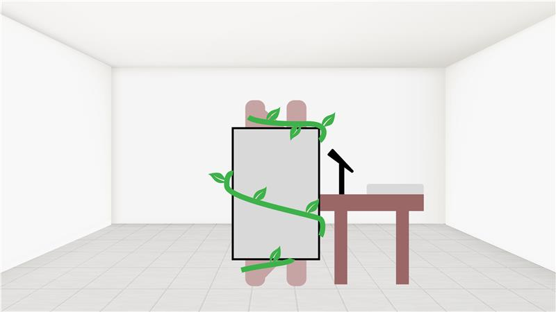
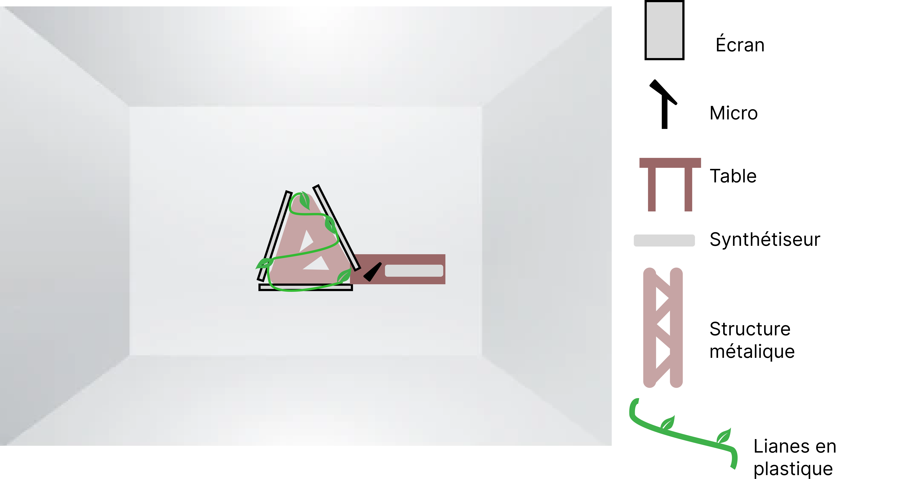

# Technique

## Plantation
Voici de quoi aura l'air l'installation.
### Vue de face




## Synoptique
````mermaid
graph TD
    Ordinateur["Ordinateur central"]

    subgraph Matériel_Principal
        Serveur["Serveur indépendant"]
    end

    subgraph Éléments_Audio
        Synthé["Synthétiseur"]
        Micro["Micro"]
        HP["Haut-parleurs"]
        Casque["Casque"]
        CarteSon["Carte de son"]
    end

    subgraph Éléments_Vidéo
        TV1["Télévision 1"]
        TV2["Télévision 2"]
        TV3["Télévision 3"]
        Lumières["Éclairage supplémentaire"]
    end

    subgraph Connectiques
        SwitchPOE["Switch POE"]
        CableEthernet["Câble Ethernet"]
    end

    %% Connexions
    Serveur --> |Gère les signaux| Ordinateur

    %% Connexions Audio
    CarteSon --> |Connectée à| Ordinateur
    Synthé --> |Entrée/Sortie audio| CarteSon
    Micro --> |Entrée audio| CarteSon
    HP --> |Sortie audio| CarteSon
    Casque --> |Sortie audio| CarteSon

    %% Connexions Vidéo
    Ordinateur --> |Envoi vidéo| TV1 & TV2 & TV3
    Ordinateur --> |Commandé par| Lumières
    TV1 --> |Connexion via| CableEthernet
    TV2 --> |Connexion via| CableEthernet
    TV3 --> |Connexion via| CableEthernet

    %% Réseau
    Ordinateur --> |Connexion réseau| SwitchPOE
    SwitchPOE --> |CableEthernet| AtomPOE


````
### Web
Voici un diagrame expliquant les communications entre la plante physique qui sera dans le studio et le site web et la plante virtuelle.

````mermaid
flowchart TD
    subgraph "Installation Physique"
        n1["Plante physique"]
        n3["Diffusion en direct"]
    end
    subgraph "Backend"
        n4["Serveur"]
        n5["Traitement des stats\net interactions"]
    end
    subgraph "Interface Utilisateur"
        n2["Site Web"]
    end
    %% Relations
    n1 ---|"Capture de l'installation et\ninteractions sonores"| n3
    n3 ---|"Stream de la plante et\nson évolution"| n2
    n4 ---|"Statistiques\nd'évolution"| n5
    n5 ---|"Visualisation des stats\nsur le site"| n2
    n4 ---|"Gestion des interactions"| n1
    n2 -->|"Actions utilisateur\n(envoyées au serveur)"| n4
````

## **Technologies utilisées**

### **Matériel :**  
1. **Instrument de musique :**  
   - Synthétiseur
   - Microphone
2. **Télévisions :**  
   - Affichage de la plante 3D en temps réel. 
3. **Haut-parleurs (4 unités) :**  
   - Son immersif et spatialisé.  
4. **Décor recyclé :**  
   - Technologie vintage (moniteurs CRT, câbles usés) et végétation intégrée.
5. **Site Web :**  
   - Diffusion de la plante en temps réel.
   - Possibilité d'envoyer des clips vocals pour aider la plante à se développer.
6. **Accessoires :**
   - câblages (HDMI, Ethernet, audio), supports techniques pour projecteurs et autres équipements.

### **Logiciels :**  
1. **Touch Designer**  
2. **Max :**  
   - Génération des sons et leur modulation par le M5Stack Button.  
3. **OSC :**  
   - Communication entre le matériel et le logiciel Unity.  
4. **QLC+ :**  
   - Contrôle des lumières
5. **Hébergeur web**  


## **Devis technique**

Voici ce qui sera fourni par l'école et ce que l'ont devra founrnir nous même.

**École :** Microphone, télévisions, hauts-parleurs et les accessoires nécéssaires à ces derniers. Ainsi que les logiciel

**Nous :** Instruments de musique autres et décors recyclé.
